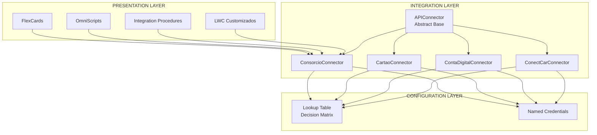
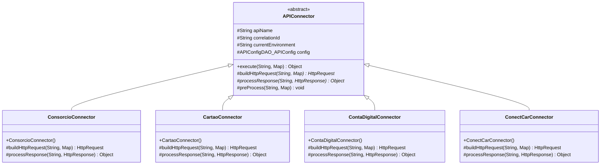
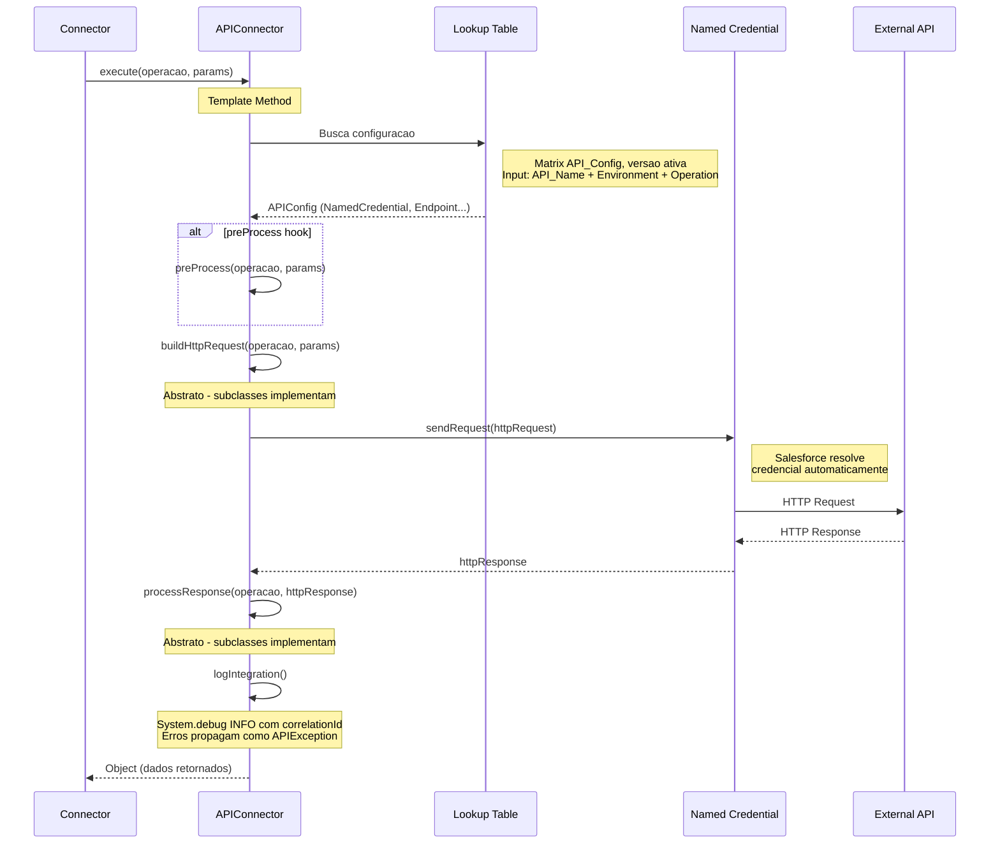
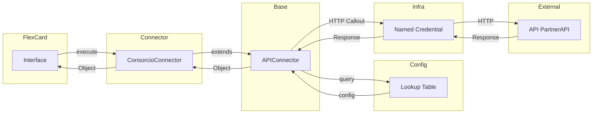
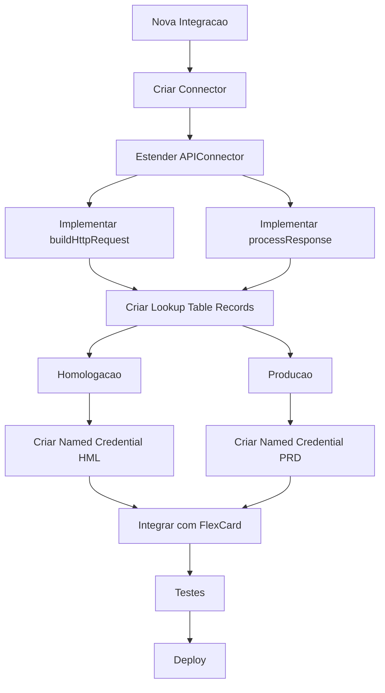

# 04 - Arquitetura de Integracoes

## Visao Geral

Arquitetura de integracoes simplificada baseada em **Open/Closed Principle** e inspirada em **microservicos**, onde novas APIs sao adicionadas com **apenas 1 classe** sem modificar o codigo existente.

## Principios da Arquitetura

| Principio | Descricao |
|-----------|-----------|
| **Open/Closed Principle** | Aberta para extensao, fechada para modificacao |
| **Simplicidade** | 1 classe por API, sem DTOs separados |
| **Risk Management** | O que funciona em prod nao e tocado |
| **Environment Aware** | Homologacao e Producao com a mesma classe |

---

## Arquitetura de Referencia

### Estrutura Simplificada

```
PARA CADA API:
──────────────
1. MeuConnector.cls (tudo junto: operacoes + request + response)

PARA 200 APIS:
──────────────
200 Connectors = 200 ARQUIVOS (+ 1 linha de config por operacao na Lookup Table)

BASE UNICA (nao mexe):
──────────────────────
APIConnector.cls (Template Method)
APIException.cls (erro com codigo + status HTTP)
APIConfigDAO.cls (le a Lookup Table API_Config)
APIConfigSetup.cls (cria a Lookup Table via codigo)
```

---

## Diagrama de Arquitetura



---

## Lookup Table (Business Rules Engine)

### O que e Lookup Table?

Lookup Tables sao um **recurso padrao do Business Rules Engine** do Salesforce. Nao sao Custom Objects - sao **objetos padrao** do Salesforce.

### Tipos de Lookup Tables

| Tipo | Descricao | Uso |
|------|-----------|-----|
| **Decision Matrix** | Tabela simples com colunas de entrada e saida | Regras estaticas, configuracoes |
| **Decision Table** | Tabela avancada que trabalha com objetos Salesforce | Regras complexas, operadores |

### Objetos Padrao do Salesforce

```
Lookup Tables (Objetos Padrao)
├── CalculationMatrix (Decision Matrix)
│   ├── Matches input values to table rows
│   ├── Returns row's output values
│   └── API Version 53.0+
│
├── CalculationMatrixColumn
│   ├── Define columns in Decision Matrix
│   ├── Input or Output columns
│   └── Data types (Text, Number, Currency, etc.)
│
├── CalculationMatrixRow
│   ├── Define rows in Decision Matrix
│   └── Input and Output values
│
├── CalculationMatrixVersion
│   ├── Versioning of Decision Matrices
│   └── Active dates and priorities
│
└── CalcMatrixColumnRange
    ├── Number range or text range columns
    └── API Version 59.0+
```

### Exemplo de Configuracao API usando Lookup Table

```
Decision Matrix: API_Config (UniqueName, Business Rules Engine)
├── Input Columns (todas Text):
│   ├── API_Name - ex: "ACME_CustomerData"
│   ├── Environment - "Homologacao" ou "Producao"
│   └── Operation - ex: "getCustomerData"
│
├── Output Columns (todas Text):
│   ├── NamedCredential - ex: "ACME_Sandbox"
│   ├── Endpoint - ex: "/customers/v1/accounts/customer-data"
│   ├── Method - ex: "GET"
│   ├── Timeout - ex: "30000"
│   ├── RetryEnabled - ex: "true"
│   ├── RetryCount - ex: "1"
│   └── LogEnabled - ex: "true"
│
├── Rows (exemplo real ACME - so getCustomerData, confirmado via cURL):
│   ├── ACME_CustomerData | Homologacao | getCustomerData | ACME_Sandbox | .../customer-data | GET | 30000 | true
│   └── ACME_CustomerData | Producao    | getCustomerData | ACME_Production    | .../customer-data | GET | 30000 | true
│
└── Criacao: 100% via codigo (APIConfigSetup.setup()) - nada manual.
    InputData/OutputData sao JSON; o DAO filtra em memoria por
    API_Name + Environment + Operation.
```

### Vantagens do Lookup Table

| Vantagem | Descricao |
|----------|-----------|
| **Objeto Padrao** | Nao precisa criar Custom Object |
| **Business Rules Engine** | Recurso nativo do Salesforce |
| **Decision Matrix** | Simples para configuracoes estaticas |
| **Decision Table** | Avancado para regras complexas |
| **Versioning** | Controle de versao e ativação |
| **Integracao** | Chamar de Flows, OmniScripts, APIs |
| **Performance** | Otimizado pelo Salesforce |
| **Seguranca** | Controle de acesso padrao |

---

## Diagrama de Heranca



---

## Diagrama de Fluxo - Execute()



---

## Estrutura de Pastas

```
force-app/main/default/
├── classes/
│   ├── APIConnector.cls              (base abstrata - Template Method)
│   ├── APIException.cls              (erro com codigo + status HTTP)
│   ├── APIConfigDAO.cls              (le a Lookup Table API_Config)
│   ├── APIConfigSetup.cls            (cria a Lookup Table via codigo)
│   ├── ACMEConnector.cls              (1 classe: operacoes + request + response)
│   ├── ACMEConnectorTest.cls          (testes com HttpCalloutMock)
│   └── APIConfigDAOTest.cls
│
├── externalCredentials/
│   ├── ACME_Sandbox_EC.externalCredential-meta.xml   (OAuth2 client_credentials)
│   └── ACME_Production_EC.externalCredential-meta.xml
│
├── namedCredentials/
│   ├── ACME_Sandbox.namedCredential-meta.xml         (SecuredEndpoint + EC)
│   └── ACME_Production.namedCredential-meta.xml
│
├── permissionsets/
│   └── API_Integration.permissionset-meta.xml           (classes + principals, todas as APIs)
│
└── scripts/ (fora do force-app, na raiz do projeto)
    ├── setup-lookup.apex          (APIConfigSetup.setup())
    ├── setup-bcp-auth.apex        (cria EC + NC via ConnectApi)
    ├── setup-acme-secrets.apex     (placeholders de client_id/secret)
    └── smoke-acme.apex             (teste fim-a-fim via instancia)
```

---

## Codigo Base

### APIConnector.cls (Abstract Base)

```apex
/**
 * @description Classe abstrata base para todas as integracoes de API.
 *              Implementa Template Method: execute() define o fluxo,
 *              cada Connector implementa buildHttpRequest() e processResponse().
 *              Configuracao vem da Lookup Table (APIConfigDAO). Sem DTOs,
 *              sem Service separado, sem Controller separado.
 */
public abstract with sharing class APIConnector {

    protected final String apiName;
    protected final String correlationId;
    protected String currentEnvironment; // nao-final: o metodo call() do Connector
                                        // sobrescreve p/ testar HML/PRD no Anonymous
    protected APIConfigDAO.APIConfig config;

    protected APIConnector(String apiName) {
        if (String.isBlank(apiName)) {
            throw APIException.create('INVALID_CONFIG', 'apiName nao pode ser vazio.');
        }
        this.apiName = apiName;
        this.currentEnvironment = APIConfigDAO.getCurrentEnvironment();
        this.correlationId = generateCorrelationId();
    }

    /**
     * @description Template Method: preProcess -> build -> send -> process -> log.
     */
    public Object execute(String operacao, Map<String, Object> params) {
        if (String.isBlank(operacao)) {
            throw APIException.create('INVALID_OPERATION', 'Operacao nao pode ser vazia.');
        }
        if (params == null) {
            params = new Map<String, Object>();
        }

        this.config = APIConfigDAO.getConfig(apiName, currentEnvironment, operacao);
        Datetime startTime = Datetime.now();
        HttpResponse httpResponse;

        try {
            preProcess(operacao, params);
            HttpRequest httpRequest = buildHttpRequest(operacao, params);
            httpResponse = sendRequest(httpRequest, config);
            Object result = processResponse(operacao, httpResponse);
            logIntegration(config, operacao, params, httpResponse, startTime, null);
            return result;
        } catch (APIException e) {
            logIntegration(config, operacao, params, httpResponse, startTime, e);
            throw e;
        } catch (Exception e) {
            APIException wrapped = APIException.create(
                'UNEXPECTED_ERROR',
                'Erro inesperado na operacao ' + operacao + ': ' + e.getMessage()
            );
            logIntegration(config, operacao, params, httpResponse, startTime, wrapped);
            throw wrapped;
        }
    }

    // =================================================================
    // METODOS ABSTRATOS - Subclasses DEVEM implementar
    // =================================================================

    /**
     * @description Constroi o HttpRequest para a operacao especifica
     * @param operacao Nome da operacao
     * @param params Parametros da operacao
     * @return HttpRequest Request pronto para envio
     */
    protected abstract HttpRequest buildHttpRequest(
        String operacao, 
        Map<String, Object> params
    );

    /**
     * @description Processa a resposta HTTP e converte para Object
     * @param operacao Nome da operacao
     * @param httpResponse Resposta HTTP recebida
     * @return Object Dados processados
     */
    protected abstract Object processResponse(
        String operacao, 
        HttpResponse httpResponse
    );

    // =================================================================
    // METODOS VIRTUAIS - Subclasses PODEM sobrescrever
    // =================================================================

    /**
     * @description Hook para pre-processamento antes do envio
     * @param operacao Nome da operacao
     * @param params Parametros da operacao
     */
    protected virtual void preProcess(String operacao, Map<String, Object> params) {
    }

    // =================================================================
    // CONCRETOS - comportamento padrao da base
    // =================================================================

    private HttpResponse sendRequest(HttpRequest httpRequest, APIConfigDAO.APIConfig cfg) {
        Integer attempts = 1 + (cfg.retryEnabled ? Math.max(0, cfg.retryCount) : 0);
        Http http = new Http();
        HttpResponse httpResponse;

        for (Integer i = 0; i < attempts; i++) {
            try {
                httpResponse = http.send(httpRequest);
            } catch (CalloutException e) {
                if (i == attempts - 1) {
                    throw APIException.create('CALLOUT_ERROR', 'Erro na chamada HTTP: ' + e.getMessage());
                }
                continue;
            }
            Integer status = httpResponse.getStatusCode();
            if ((status >= 200 && status < 300) || status != 401 || i == attempts - 1) {
                return httpResponse;
            }
        }
        return httpResponse;
    }

    private void logIntegration(
        APIConfigDAO.APIConfig cfg,
        String operacao,
        Map<String, Object> params,
        HttpResponse response,
        Datetime startTime,
        Exception error
    ) {
        if (cfg == null || cfg.logEnabled != true) {
            return;
        }
        Long elapsedMs = Datetime.now().getTime() - startTime.getTime();
        System.debug(
            LoggingLevel.INFO,
            'INTEGRATION correlationId=' + correlationId +
            ' api=' + cfg.apiName +
            ' env=' + cfg.environment +
            ' operacao=' + operacao +
            ' endpoint=' + cfg.endpoint +
            ' method=' + cfg.method +
            ' status=' + (response != null ? String.valueOf(response.getStatusCode()) : 'N/A') +
            ' elapsedMs=' + elapsedMs +
            (error != null ? ' error=' + error.getMessage() : '')
        );
    }

    private String generateCorrelationId() {
        return UserInfo.getUserId() + '_' + Datetime.now().getTime() + '_' + Crypto.getRandomInteger();
    }
}
```

---

### APIConfigDAO.cls (DAO para Lookup Table)

```apex
/**
 * @description DAO de configuracao das integracoes.
 *              Le a Lookup Table (Business Rules Engine - CalculationMatrix)
 *              UniqueName 'API_Config' e resolve a configuracao por
 *              API + ambiente + operacao. Sem Custom Object, sem hardcode.
 */
public with sharing class APIConfigDAO {

    public static final String MATRIX_UNIQUE_NAME = 'API_Config';

    /**
     * @description Configuracao de uma operacao de API (valor, nao SObject).
     */
    public class APIConfig {
        public String apiName;
        public String environment;
        public String operation;
        public String namedCredential;
        public String endpoint;
        public String method;
        public Integer timeout;
        public Boolean retryEnabled;
        public Integer retryCount;
        public Boolean logEnabled;
    }

    @TestVisible
    private static APIConfig mockConfig;

    private static Map<String, APIConfig> cache = new Map<String, APIConfig>();

    /**
     * @description Resolve a configuracao da Lookup Table.
     */
    public static APIConfig getConfig(String apiName, String environment, String operation) {
        String key = apiName + '|' + environment + '|' + operation;
        if (cache.containsKey(key)) {
            return cache.get(key);
        }
        if (Test.isRunningTest() && mockConfig != null) {
            cache.put(key, mockConfig);
            return mockConfig;
        }

        List<CalculationMatrix> matrices = [
            SELECT Id
            FROM CalculationMatrix
            WHERE UniqueName = :MATRIX_UNIQUE_NAME
            LIMIT 1
        ];
        if (matrices.isEmpty()) {
            throw APIException.create(
                'CONFIG_NOT_FOUND',
                'Lookup Table API_Config nao encontrada. Execute APIConfigSetup.setup().'
            );
        }

        List<CalculationMatrixVersion> versions = [
            SELECT Id
            FROM CalculationMatrixVersion
            WHERE CalculationMatrixId = :matrices[0].Id
            AND IsEnabled = true
            ORDER BY VersionNumber DESC
            LIMIT 1
        ];
        if (versions.isEmpty()) {
            throw APIException.create(
                'CONFIG_NOT_FOUND',
                'Nenhuma versao ativa na Lookup Table API_Config.'
            );
        }

        // InputData/OutputData sao JSON; o filtro e feito em memoria.
        List<CalculationMatrixRow> rows = [
            SELECT InputData, OutputData
            FROM CalculationMatrixRow
            WHERE CalculationMatrixVersionId = :versions[0].Id
            LIMIT 1000
        ];
        for (CalculationMatrixRow row : rows) {
            Map<String, Object> input = parseJson(row.InputData);
            if (input == null) {
                continue;
            }
            if (
                String.valueOf(input.get('API_Name')) == apiName &&
                String.valueOf(input.get('Environment')) == environment &&
                String.valueOf(input.get('Operation')) == operation
            ) {
                APIConfig cfg = buildConfig(apiName, environment, operation, parseJson(row.OutputData));
                cache.put(key, cfg);
                return cfg;
            }
        }

        throw APIException.create(
            'CONFIG_NOT_FOUND',
            'Configuracao nao encontrada: ' + apiName + ' / ' + environment + ' / ' + operation
        );
    }

    /**
     * @description Ambiente corrente: sandbox = Homologacao, producao = Producao.
     */
    public static String getCurrentEnvironment() {
        try {
            Organization org = [SELECT IsSandbox FROM Organization LIMIT 1];
            return org.IsSandbox ? 'Homologacao' : 'Producao';
        } catch (Exception e) {
            return 'Homologacao';
        }
    }
    // ... (buildConfig/parseJson/toText/toInteger/toBoolean + clearCache -
    // ver codigo-fonte; todos com defaults: timeout 30000, log true)
}
```

> Como as linhas nascem: `APIConfigSetup.setup()` cria matrix + versao + colunas + linhas via codigo (idempotente). Nada manual no Setup. Ver guia `06-passo-a-passo-nova-api.md`.

---

### APIException.cls (Custom Exception)

```apex
/**
 * @description Excecao customizada para erros de integracao com APIs externas.
 *              Carrega codigo de erro e status HTTP para diagnostico.
 */
public class APIException extends Exception {

    private String errorCode;
    private Integer httpStatusCode;
    private String apiMessage;

    /**
     * @description Fabrica: Apex nao permite super(message) explicito,
     *              por isso a instancia usa o construtor base herdado.
     */
    public static APIException create(String errorCode, String message) {
        APIException e = new APIException(message);
        e.errorCode = errorCode;
        return e;
    }

    public static APIException create(String errorCode, String message, Integer httpStatusCode) {
        APIException e = create(errorCode, message);
        e.httpStatusCode = httpStatusCode;
        return e;
    }

    public String getErrorCode() { return errorCode; }
    public Integer getHttpStatusCode() { return httpStatusCode; }
    public String getApiMessage() { return apiMessage; }
    public void setApiMessage(String apiMessage) { this.apiMessage = apiMessage; }
}
```

Uso: `throw APIException.create('ACME_ERROR', 'mensagem', status);`

---

## Exemplo: Nova Integracao (Simples)

### Passo 1: Criar o Connector (1 arquivo)

```apex
// ConsorcioConnector.cls - TUDO EM UMA CLASSE
public with sharing class ConsorcioConnector extends APIConnector {

    public ConsorcioConnector() {
        super('Consorcio_Base');
    }

    // =========================================================
    // MONTAR REQUEST (tudo em um metodo)
    // =========================================================
    protected override HttpRequest buildHttpRequest(
        String operacao, 
        Map<String, Object> params
    ) {
        HttpRequest request = new HttpRequest();
        
        // Endpoint varia por operacao
        String endpoint = 'callout:' + config.namedCredential
                        + config.endpoint;
        
        switch on operacao {
            when 'getQuotas' {
                endpoint += '/clientes/' + params.get('clienteId') + '/quotas';
                request.setMethod('GET');
            }
            when 'gerarBoleto' {
                endpoint += '/boletos';
                request.setMethod('POST');
                request.setBody(JSON.serialize(params));
            }
            when 'antecipar' {
                endpoint += '/antecipacoes';
                request.setMethod('POST');
                request.setBody(JSON.serialize(params));
            }
            when 'getExtrato' {
                endpoint += '/clientes/' + params.get('clienteId') + '/extrato';
                request.setMethod('GET');
            }
        }
        
        request.setEndpoint(endpoint);
        request.setHeader('Content-Type', 'application/json');
        request.setHeader('X-Correlation-ID', correlationId);
        request.setTimeout(config.timeout);
        
        return request;
    }

    // =========================================================
    // PROCESSAR RESPOSTA (tudo em um metodo)
    // =========================================================
    protected override Object processResponse(
        String operacao, 
        HttpResponse response
    ) {
        if (response.getStatusCode() >= 200 && 
            response.getStatusCode() < 300) {
            
            // Sucesso - retornar dados
            return JSON.deserializeUntyped(response.getBody());
            
        } else {
            // Erro - lancar excecao
            Map<String, Object> errorMap = (Map<String, Object>) 
                JSON.deserializeUntyped(response.getBody());
            
            throw APIException.create(
                'CONSORCIO_ERROR',
                'Erro na operacao ' + operacao + ': ' +
                (String) errorMap.get('message'),
                response.getStatusCode()
            );
        }
    }

    // METODO COMUM A TODO CONNECTOR (override de ambiente p/ teste manual)
    public Object call(String operacao, Map<String, Object> params, String environment) {
        this.currentEnvironment = environment;
        return this.execute(operacao, params);
    }
}
```

### Passo 2: Criar Registros na Lookup Table (via codigo)

Nada manual: adicione as linhas em `APIConfigSetup` e rode `scripts/setup-lookup.apex`.

```
Decision Matrix: API_Config (UniqueName)
──────────────────────────────────
Input (API_Name, Environment, Operation):
├── Consorcio_Base | Homologacao | getQuotas
└── Consorcio_Base | Producao    | getQuotas

Output (NamedCredential, Endpoint, Method, Timeout, RetryEnabled, RetryCount, LogEnabled):
├── PartnerAPI_Homologacao | /api/v1/consorcio | GET | 30000 | true | 1 | true
└── PartnerAPI_Producao    | /api/v1/consorcio | GET | 30000 | true | 1 | true
```

---

## Resumo da Arquitetura

```
ARQUITETURA DE REFERENCIA (codigo real, em producao com ACME):
─────────────────────────────────────────────────────────────
BASE (1x, nao mexe):
├── APIConnector.cls
├── APIException.cls
├── APIConfigDAO.cls
└── APIConfigSetup.cls

POR API (ex: ACME):
├── ACMEConnector.cls (+ ACMEConnectorTest.cls)
├── ACME_Sandbox_EC + ACME_Production_EC (External Credentials OAuth2)
├── ACME_Sandbox + ACME_Production (Named Credentials)
└── Linhas na Lookup Table API_Config (1 por operacao x ambiente)

PARA 200 APIS:
──────────────
200 Connectors + linhas de config. Base continua 4 arquivos.
```

---

## Diagrama: Fluxo Completo



---

## Tabela: Componentes por Camada

| Camada | Componentes | Responsabilidade |
|--------|-------------|------------------|
| **Presentation** | FlexCards, OmniScripts, LWC | Interface com o usuario |
| **Integration** | APIConnector, Connectors | Comunicacao HTTP |
| **Configuration** | Lookup Table, Named Credentials | Configuracao por ambiente |
| **Infrastructure** | APIConfigSetup, scripts/*.apex | Setup via codigo + smoke test |

---

## Fluxo de Criacao de Nova Integracao



---

## Checklist: Nova Integracao

- [ ] Criar Connector (extends APIConnector) + operacoes `@AuraEnabled`
- [ ] Implementar buildHttpRequest() + processResponse()
- [ ] Adicionar metodo `call()` (override de ambiente p/ teste manual)
- [ ] Adicionar linhas na Lookup Table via `APIConfigSetup` (nada manual)
- [ ] Criar External Credential + Named Credential (script `setup-<api>-auth.apex`)
- [ ] Preencher client_id/secret + marcar Enabled for Callouts (unico passo UI)
- [ ] Adicionar `classAccesses` + principals no Permission Set `API_Integration` (unico)
- [ ] Criar testes com `HttpCalloutMock` + `APIConfigDAO.mockConfig`
- [ ] Smoke test via `scripts/smoke-<api>.apex` (HML e PRD via `call()`)
- [ ] Integrar com FlexCard/OmniScript (Remote Action no Connector)
- [ ] Deploy + atribuir `API_Integration` ao usuario (detalhe no guia 06)

---

## Vantagens desta Arquitetura

| Vantagem | Descricao |
|----------|-----------|
| **Simplicidade** | 1 classe por API, sem DTOs separados |
| **Risco Zero** | Base testada, extensoes isoladas |
| **Velocidade** | Nova integracao em horas, nao semanas |
| **Manutencao** | Correcoes na base afetam todas |
| **Flexibilidade** | Homologacao e Producao com a mesma classe |
| **Escalabilidade** | Sistema cresce sem limites |
| **Onboarding** | Novos devs aprendem o padrao rapido |

---

## Status e Proximos Passos

**Pronto e validado no org YourOrg (ACME):** base + Lookup Table via codigo +
OAuth2 + 9/9 testes + smoke test fim-a-fim (HML e PRD via `call()`).

Cobertura real: `ACMEConnector` 93%, `APIConnector` 71%, `APIException` 75%, `APIConfigDAO` 24%.

Artefatos criados/deployados estao listados no doc `07-inventario-artefatos.md`.

1. **Secrets + UI:** preencher client_id/secret reais e ligar Enabled for Callouts
   (HML e PRD, 1 tela) — detalhe no `06`, Passo 1.5
2. **Replicar** o padrao para a proxima API seguindo o guia `06-passo-a-passo-nova-api.md`
3. **Padroes de nomenclatura:** `<API>Connector`, `<API>_Homologacao[_EC]`, API_Name = `<API>_Recurso`, Permission Set unico `API_Integration`
4. **Treinar** equipe no guia 06 (procedimento de escala)

### Observacoes de ambiente (importante)

- O auto-detect `Organization.IsSandbox` resolve `Homologacao` em sandbox real e
  `Producao` em producao. A org de validacao FSC reporta `IsSandbox=false`, entao
  `execute()` cai em `Producao`. Para testar os dois ambientes em qualquer org,
  use `call(operacao, params, 'Homologacao'|'Producao')`.
- `API_Integration` e o unico Permission Set das integracoes (todas as APIs).
