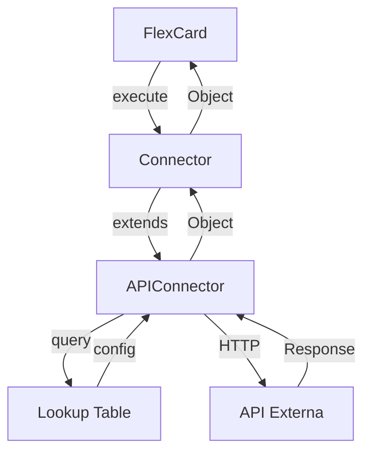
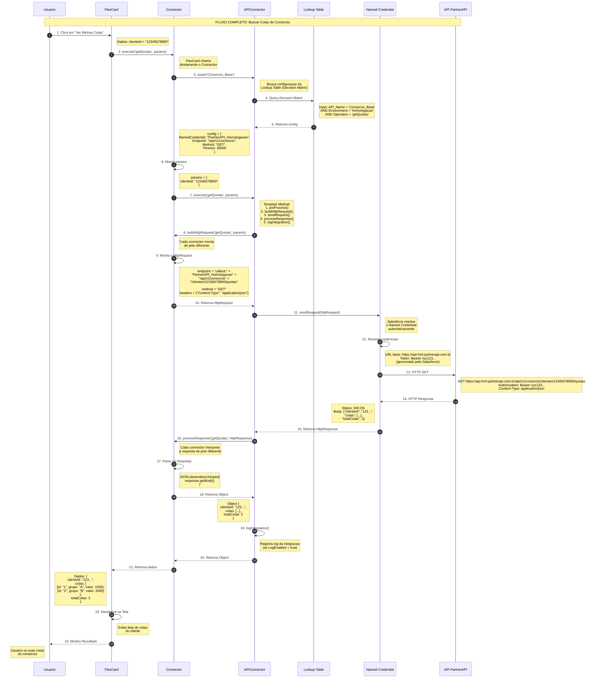
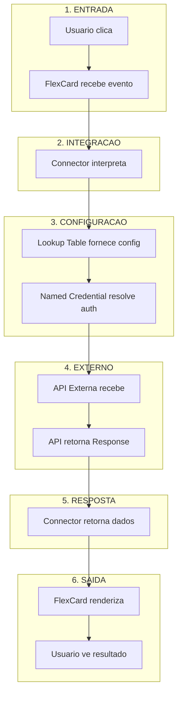

# 05 - Explicacao Simples da Arquitetura

## Para Que Serve Esta Arquitetura?

Imagine que voce tem uma **caixa de ferramentas**. Quando voce precisa conectar uma nova API, voce nao compra uma caixa de ferramentas nova - voce apenas adiciona uma **ferramenta nova** na caixa que ja existe.

Esta arquitetura faz exatamente isso: **uma caixa de ferramentas unica** que serve para todas as integracoes.

---

## Como Funciona (Explicacao Simplificada)

### A Solucao (Arquitetura de Referencia)

```
┌─────────────────────────────────────────────────────────────┐
│  SOLUCAO: Uma unica caixa de ferramentas para todas APIs    │
├─────────────────────────────────────────────────────────────┤
│                                                             │
│  ┌─────────────────────────────────────────────────────┐    │
│  │              CAIXA UNICA (APIConnector)              │    │
│  │                                                     │    │
│  │  Ferramentas:                                       │    │
│  │  ├── Enviar HTTP ──────────────────── (ja existe)   │    │
│  │  ├── Tratar Erros ─────────────────── (ja existe)   │    │
│  │  ├── Registrar Logs ───────────────── (ja existe)   │    │
│  │  └── Configurar ───────────────────── (ja existe)   │    │
│  │                                                     │    │
│  │  Para cada API, voce apenas ADICIONA:                │    │
│  │  └── 1 classe com tudo junto ──────── (novo)        │    │
│  │                                                     │    │
│  └─────────────────────────────────────────────────────┘    │
│                                                             │
│  RESULTADO: 1 caixa, todas as APIs funcionando              │
│  VANTAGEM: Quando voce mexe na caixa, TODAS as APIs         │
│            se beneficiam da melhoria                        │
└─────────────────────────────────────────────────────────────┘
```

---

## Arquitetura de Referencia

### Quantos Arquivos por API?

```
ARQUITETURA DE REFERENCIA:
──────────────────────────
Para cada API: 1 arquivo (Connector com tudo junto)
Para 200 APIs: 200 arquivos
```

---

## Os Arquivos e Seus Papeis

### 1. APIConnector.cls (O Chefe)

**O que e:** A classe abstrata base - o "chefe" que coordena tudo.

**O que faz:**
- Define o **fluxo padrao** de como uma integracao deve funcionar
- Executa o HTTP callout
- Trata erros
- Registra logs
- Busca configuracao da **Lookup Table**

**Analogia:** E o **gerente do restaurante**. Ele nao cozinha, nao atende mesas, nao lava louca - ele apenas **organiza** quem faz o que.

```
APIConnector (Gerenciador)
├── Buscar configuracao ──────── (Lookup Table)
├── Preparar request ─────────── (organiza)
├── Enviar para API ──────────── (organiza)
├── Receber resposta ─────────── (organiza)
├── Tratar erros ─────────────── (organiza)
└── Registrar log ────────────── (organiza)
```

**O que e IMUTAVEL (nao muda):**
- O fluxo de execucao (Template Method)
- O metodo que envia HTTP
- O metodo que registra log

**O que e MUTAVEL (pode ser alterado pelas subclasses):**
- Como montar o request (cada API e diferente)
- Como interpretar a resposta (cada API retorna dados diferentes)

---

### 2. APIException.cls (O Alerta)

**O que e:** Uma classe que representa um erro na integracao.

**O que faz:**
- Guarda o codigo do erro
- Guarda a mensagem de erro
- Guarda o status HTTP (se aplicavel)

**Analogia:** E o **alarme de incendio** do restaurante. Quando algo da errado, ele avisa todo mundo.

```
Exemplo de uso (codigo real):
────────────────────────────
throw APIException.create(
    'INTEGRATION_ERROR',
    'Erro ao conectar com a API PartnerAPI'
);
```
> Detalhe real: Apex nao permite `super(message)` explicito, por isso a classe expoe a fabrica `create(codigo, mensagem [, statusHttp])`.

**O que e IMUTAVEL:**
- A estrutura (errorCode, message, httpStatusCode)

---

### 3. Lookup Table (A Tabela de Configuracao)

**O que e:** Um **recurso padrao do Business Rules Engine** do Salesforce. Nao e um Custom Object - e um **objeto padrao** do Salesforce.

**O que faz:**
- Guarda as configuracoes de cada API
- Permite ter configuracoes diferentes para **Homologacao** e **Producao**
- Facilita a manutencao
- Pode ser chamado de Flows, OmniScripts ou APIs

**Analogia:** E o **cardapio do restaurante**. Ele diz qual cozinha prepara qual prato, e quais ingredientes usar.

```
Decision Matrix (Cardapio)
├── Input Columns (O que o cliente pede):
│   ├── API_Name: "Consorcio_Quotas"
│   ├── Environment: "Homologacao" ou "Producao"
│   └── Operation: "getQuotas"
│
└── Output Columns (O que a cozinha faz):
    ├── NamedCredential: "PartnerAPI_Homologacao"
    ├── Endpoint: "/api/v1/quotas"
    ├── Method: "GET"
    └── Timeout: 30000
```

**Vantagens:**
- **Objeto Padrao** - Nao precisa criar Custom Object
- **Business Rules Engine** - Recurso nativo do Salesforce
- **Integracao** - Chamar de Flows, OmniScripts, APIs
- **Performance** - Otimizado pelo Salesforce
- **Seguranca** - Controle de acesso padrao

---

### 4. ConsorcioConnector.cls (A Ferramenta do Consorcio)

**O que e:** Uma classe concreta que sabe como falar com a API do Consorcio.

**O que faz:**
- Monta o request no formato que a API espera
- Interpreta a resposta da API
- **TUDO EM UMA CLASSE** (sem Request/Response separados)

**Analogia:** E o **cozinha especializada em massa**. Ele sabe exatamente como fazer a massa perfeita.

```
ConsorcioConnector (Especialista em Consorcio)
│
├── buildHttpRequest()
│   ├── Se operacao = "getQuotas"
│   │   └── Endpoint: /clientes/{id}/quotas
│   ├── Se operacao = "gerarBoleto"
│   │   └── Endpoint: /boletos (POST)
│   └── Se operacao = "antecipar"
│       └── Endpoint: /antecipacoes (POST)
│
└── processResponse()
    ├── Status 200: Sucesso! Retornar dados
    ├── Status 401: Token invalido
    └── Status 500: Erro interno
```

**O que e IMUTAVEL:**
- Nada - esta classe NUNCA e modificada depois de criada

**O que e MUTAVEL:**
- Nada - se precisar mudar, cria uma nova classe

---

## Resumo: O Que Cada Arquivo Faz

| Arquivo | Papel | Analogia |
|---------|-------|----------|
| **APIConnector** | Coordena tudo | Gerente do restaurante |
| **APIException** | Alerta de erro | Alarme de incendio |
| **Lookup Table** | Configuracao | Cardapio do restaurante |
| **ConsorcioConnector** | Fala com API | Cozinha especializada |

---

## O Que Nao Muda (IMUTAVEL)

Estes arquivos **NUNCA** sao modificados quando voce adiciona uma nova API:

```
┌─────────────────────────────────────────────────────────────┐
│  IMUTAVEL (nao mexe)                                        │
├─────────────────────────────────────────────────────────────┤
│  APIConnector.cls ─────────── Logica base de integracao     │
│  APIException.cls ─────────── Estrutura de erro             │
│  APIConfigDAO.cls ──────────── Acesso a Lookup Table        │
│  APIConfigSetup.cls ────────── Cria a Lookup Table via codigo │
└─────────────────────────────────────────────────────────────┘
```

**Por que nao muda?** Porque e a **base da caixa de ferramentas**. Se voce mexer nela, pode quebrar tudo que ja esta funcionando.

---

## O Que e Novo (MUTAVEL)

Quando voce adiciona uma nova API, voce cria **APENAS** estes arquivos:

```
┌─────────────────────────────────────────────────────────────┐
│  NOVO (cria quando precisa)                                 │
├─────────────────────────────────────────────────────────────┤
│  Para cada API:                                             │
│  └── MeuNovoConnector.cls ──── Tudo junto (1 arquivo)      │
│                                                             │
│  Na Lookup Table (via APIConfigSetup):                      │
│  └── 1 linha por operacao x ambiente (ex: 2 ops = 4 linhas) │
└─────────────────────────────────────────────────────────────┘
```

**Por que e novo?** Porque e uma **ferramenta nova** na caixa. Voce apenas adiciona, nao mexe no que ja existe.

---

## Exemplo: Adicionando a API do Itau

### Passo 1: Criar o Connector (1 arquivo)

```apex
// ItauConnector.cls - NOVO ARQUIVO (mesmo formato do ACMEConnector real)
public with sharing class ItauConnector extends APIConnector {

    private static final String API_NAME = 'Itau_Base';

    public ItauConnector() {
        super(API_NAME);  // Config da Lookup Table
    }

    // Operacoes chamaveis direto da FlexCard (sem Service/Controller)
    @AuraEnabled(cacheable=true)
    public static Object getSaldo(String contaId) {
        try {
            return new ItauConnector().execute(
                'getSaldo',
                new Map<String, Object>{ 'contaId' => contaId }
            );
        } catch (Exception e) {
            throw new AuraHandledException(e.getMessage());
        }
    }

    protected override HttpRequest buildHttpRequest(
        String operacao,
        Map<String, Object> params
    ) {
        HttpRequest httpRequest = new HttpRequest();

        String endpoint = 'callout:' + config.namedCredential
                        + config.endpoint;

        switch on operacao {
            when 'getSaldo' {
                endpoint += '/contas/' + params.get('contaId') + '/saldo';
                httpRequest.setMethod('GET');
            }
            when 'transferir' {
                endpoint += '/transferencias';
                httpRequest.setMethod('POST');
                httpRequest.setBody(JSON.serialize(params));
            }
            when else {
                throw APIException.create('INVALID_OPERATION', 'Operacao desconhecida: ' + operacao);
            }
        }

        httpRequest.setEndpoint(endpoint);
        httpRequest.setHeader('Content-Type', 'application/json');
        httpRequest.setHeader('X-Correlation-ID', correlationId);
        httpRequest.setTimeout(config.timeout);

        return httpRequest;
    }

    protected override Object processResponse(
        String operacao,
        HttpResponse httpResponse
    ) {
        if (httpResponse.getStatusCode() == 200) {
            return JSON.deserializeUntyped(httpResponse.getBody());
        }

        throw APIException.create(
            'ITAU_ERROR',
            'Erro na operacao ' + operacao,
            httpResponse.getStatusCode()
        );
    }
}
```

### Passo 2: Criar Registros na Lookup Table (via codigo, nada manual)

Adicione as linhas em `APIConfigSetup` e rode `scripts/setup-lookup.apex`:

```
Decision Matrix: API_Config (UniqueName)
──────────────────────────────────
Itau_Base | Homologacao | getSaldo   -> Itau_Homologacao | /api/v1/itau | GET | 30000 | true
Itau_Base | Producao    | getSaldo   -> Itau_Producao    | /api/v1/itau | GET | 30000 | true
Itau_Base | Homologacao | transferir -> Itau_Homologacao | /api/v1/itau | GET | 30000 | true
Itau_Base | Producao    | transferir -> Itau_Producao    | /api/v1/itau | GET | 30000 | true
```
(1 linha por operacao x ambiente; colunas de saida completas: NamedCredential, Endpoint, Method, Timeout, RetryEnabled, RetryCount, LogEnabled.)

### Resumo

```
AO ADICIONAR a API do Itau:
──────────────────────────
APIConnector (NAO MEXEU)
APIException (NAO MEXEU)
APIConfigDAO (NAO MEXEU)
ConsorcioConnector (NAO MEXEU)
CartaoConnector (NAO MEXEU)
ItauConnector (NOVO)
Lookup Table Itau_Base Homologacao (NOVO)
Lookup Table Itau_Base Producao (NOVO)
```

---

## Lookup Table: Homologacao vs Producao

### Como Funciona?

```
┌─────────────────────────────────────────────────────────────┐
│  HOMOLOGACAO                                                │
│  Lookup Table WHERE Environment = 'Homologacao'             │
│  └── NamedCredential: PartnerAPI_Homologacao                    │
│      └── URL: https://api-hml.partnerapi.com.br             │
├─────────────────────────────────────────────────────────────┤
│  PRODUCAO                                                   │
│  Lookup Table WHERE Environment = 'Producao'                │
│  └── NamedCredential: PartnerAPI_Producao                       │
│      └── URL: https://api.partnerapi.com.br                 │
└─────────────────────────────────────────────────────────────┘
```

### Mesma Classe, Diferentes Configs

```
ConsorcioConnector.cls (1 unica classe)
│
├── Em HOMOLOGACAO:
│   └── Usa Lookup Table "Consorcio_Base" + "Homologacao"
│       └── NamedCredential: PartnerAPI_Homologacao
│
└── Em PRODUCAO:
    └── Usa Lookup Table "Consorcio_Base" + "Producao"
        └── NamedCredential: PartnerAPI_Producao
```

**Vantagem:** A mesma classe funciona em ambos os ambientes!

### Como escolher o ambiente no teste

- Em uso normal, o `execute()` resolve sozinho: `Organization.IsSandbox` = true em
  sandbox (vai para `Homologacao`), false em producao (vai para `Producao`).
- Para testar manualmente (Developer Console / Execute Anonymous), use o `call()`:
  `new ACMEConnector().call('getCustomerData', params, 'Homologacao')` ou
  `..., 'Producao')`. Assim voce testa os dois ambientes da mesma janela.
- Atencao: a org de validacao FSC reporta `IsSandbox=false`, entao o `execute()`
  cai em `Producao`. Use sempre o `call()` explicito para testar HML nela.

---

## Termos Tecnicos Explicados

### API (Application Programming Interface)

**Explicacao simples:** E um **garcom** que leva seu pedido para a cozinha e traz a resposta.

**Como funciona:**
1. Voce faz um pedido (request)
2. O garcom leva para a cozinha (API externa)
3. A cozinha prepara (processa)
4. O garcom traz o resultado (response)

---

### HTTP (HyperText Transfer Protocol)

**Explicacao simples:** E a **linguagem** que computadores usam para conversar pela internet.

**Verbos HTTP:**
- **GET** = "Me mostre" (buscar dados)
- **POST** = "Crie" (criar novo registro)
- **PUT** = "Atualize" (modificar existente)
- **DELETE** = "Remova" (apagar registro)

---

### Named Credential

**Explicacao simples:** E um **conta-senha salvo** no Salesforce para acessar APIs externas.

**Por que e util?**
- Nao precisa salvar senha no codigo
- Salesforce gerencia o token automaticamente
- Mais seguro

---

### Lookup Table (Business Rules Engine)

**Explicacao simples:** E um **recurso padrao do Business Rules Engine** do Salesforce. Nao e um Custom Object - e um **objeto padrao** do Salesforce.

**Para que serve?**
- Guardar nomes de endpoints
- Guardar timeouts
- Guardar se deve usar retry
- **Permitir configuracoes diferentes para Homologacao e Producao**

**Tipos de Lookup Tables:**
- **Decision Matrix** - Tabela simples com colunas de entrada e saida
- **Decision Table** - Tabela avancada que trabalha com objetos Salesforce

**Vantagens:**
- **Objeto Padrao** - Nao precisa criar Custom Object
- **Business Rules Engine** - Recurso nativo do Salesforce
- **Integracao** - Chamar de Flows, OmniScripts, APIs
- **Performance** - Otimizado pelo Salesforce
- **Seguranca** - Controle de acesso padrao

---

### Template Method Pattern

**Explicacao simples:** E uma **receita de bolo** onde o bolo base e sempre o mesmo, mas cada cozinheiro pode mudar os ingredientes.

```
RECEITA BASE (APIConnector):
1. Preparar ────────────────── (sempre igual)
2. Assar ────────────────────── (sempre igual)
3. Decorar ──────────────────── (cada um muda)

CADA COZINHEIRO (Connector):
- Consorcio: Decorar com frutas
- Cartao: Decorar com chocolate
- ContaDigital: Decorar com caramelo
```

---

### Open/Closed Principle

**Explicacao simples:** O sistema deve ser **aberto para adicionar** coisas novas, mas **fechado para modificar** o que ja existe.

**Exemplo:**
- ADICIONAR ItauConnector = OK (aberto para extensao)
- MEXER no APIConnector = NAO OK (fechado para modificacao)

---

### Abstracao

**Explicacao simples:** E criar uma **ideia geral** de como algo funciona, sem entrar em detalhes especificos.

**Exemplo:**
- APIConnector = "Toda integracao precisa de..."
- Nao importa se e Consorcio ou Cartao

---

### Heranca

**Explicacao simples:** E quando uma classe **aprende** com outra e herda seu comportamento.

**Exemplo:**
- ConsorcioConnector HERDA de APIConnector
- Portanto, ConsorcioConnector SABE fazer tudo que APIConnector sabe
- Mas pode fazer de jeito proprio

---

### Override (Sobrescrever)

**Explicacao simples:** E quando uma classe filha **muda** o comportamento da classe pai.

**Exemplo:**
- APIConnector diz "monte o request assim"
- ConsorcioConnector diz "eu monto de jeito diferente"
- Mas o fluxo base continua o mesmo

---

## Resumo Final

| Conceito | Explicacao Simples |
|----------|-------------------|
| **Arquitetura** | Caixa de ferramentas unica |
| **APIConnector** | Gerente que coordena tudo |
| **Connectors** | Ferramentas especificas para cada API |
| **Lookup Table** | Cardapio com configuracoes (Business Rules Engine) |
| **IMUTAVEL** | Base da caixa (nao mexe) |
| **MUTAVEL** | Ferramentas novas (cria quando precisa) |

---

## Fluxo Visual



**Cada seta e uma "entrega" de dados. Cada caixa e uma "responsabilidade" separada.**

---

## Fluxo Completo: Passo a Passo de uma Chamada API

Este diagrama mostra **exatamente** o que acontece quando o usuario clica em um botao na FlexCard ate a resposta voltar para a tela.

### Exemplo: "Buscar Cotas do Consorcio"



---

### Dados que Passam em Cada Etapa

| Etapa | De | Para | Dados |
|-------|-----|------|-------|
| 1 | Usuario | FlexCard | `clienteId = "12345678900"` |
| 2 | FlexCard | Connector | `execute('getQuotas', params)` |
| 3-5 | Connector | Lookup Table | Query por nome e ambiente |
| 6 | Connector | Connector | `params = {clienteId: "12345678900"}` |
| 7-8 | Connector | APIConnector | `operacao + params` |
| 9-10 | Connector | APIConnector | `httpRequest` |
| 11-12 | APIConnector | Named Credential | `httpRequest` |
| 13 | Named Credential | API | `HTTP GET + Bearer token` |
| 14 | API | Named Credential | `200 OK + body JSON` |
| 15-16 | APIConnector | Connector | `httpResponse` |
| 17-18 | Connector | APIConnector | `Object (dados)` |
| 19 | APIConnector | APIConnector | `log Integration` |
| 20-21 | APIConnector | Connector | `Object` |
| 22-23 | FlexCard | Usuario | `tela com as cotas` |

---

### Resumo: O Que Cada Camada Faz



---

### Checkpoint: O Que Verificar Se Der Erro

| Etapa | Se deu erro | O que verificar |
|-------|-------------|-----------------|
| **1-2** | FlexCard nao chama | Verificar Remote Action no FlexCard |
| **3-5** | Config nao carrega | Verificar registro na Lookup Table |
| **7-10** | Request invalido | Verificar `buildHttpRequest()` no Connector |
| **11-13** | Auth falha | Verificar Named Credential configurado |
| **14-15** | API retorna erro | Verificar URL, token, body da API |
| **16-18** | Parse falha | Verificar `processResponse()` no Connector |
| **20-21** | Dados vazios | Verificar se connector retorna dados |
