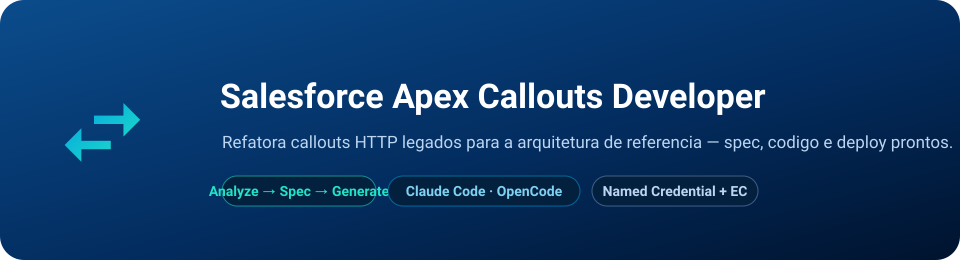

<p align="center">
  
</p>

<p align="center">
  <em>A skill que refatora qualquer callout HTTP Apex legado para a arquitetura FSC TO BE &#8212; com spec, código e artefatos de deploy prontos.</em>
</p>

<p align="center">
  
  
  
  
  
</p>

<p align="center">
  <b>📄 README</b> &nbsp;·&nbsp; <a href="./.claude/skills/apex-callouts-developer/SKILL.md">📖 SKILL.md</a> &nbsp;·&nbsp; <a href="./LICENSE">⚖️ MIT License</a>
</p>

---

Arquitetura **spec-driven** para refatorar callouts HTTP Apex legados para o padrão FSC TO BE: **Template Method + Lookup Table + Named Credential Custom EC + Cache de Token**. Aceita qualquer forma de input — curl, classe legada, Custom Metadata ou linguagem natural — e entrega todos os artefatos prontos para deploy.

**4 fases com subagentes especializados:**

```
INPUT (curl | .cls | CMT | descrição)
      ↓
  [Analyze AS IS] → classifica padrão de auth (A–F), extrai contrato
      ↓
  [Spec] → gera spec aprovável antes de qualquer código
      ↓   ← APROVAÇÃO EXPLÍCITA NECESSÁRIA
  [Generate TO BE] → XConnector.cls + testes + EC/NC XML + scripts
      ↓
  [Validate] → checklists + evidência + comando de deploy completo
```

**Como funciona:**
- **Referências** (Apex base, ECs/NCs validados, Lookup Table real da ORG, ADRs) → na pasta `.claude/skills/apex-callouts-developer/references/`.
- **Orquestração** (4 fases, anti-racionalizações, checklists, evidência obrigatória) → `SKILL.md` + 4 agentes em `.claude/agents/`.

Você informa o input → a skill conduz as 4 fases → entrega o comando `sf project deploy start` com todos os artefatos prontos.

---

## ⚡ Começo rápido

### 1. Pré-requisitos

- [Salesforce CLI v2](https://developer.salesforce.com/tools/salesforcecli) (`sf`), autenticado: `sf org login web --alias minhaOrg`
- Node 18+
- Projeto SFDX com `force-app/*/classes/`

> **Opcional — rodar de graça com [OpenCode](https://opencode.ai)** (sem key, sem GPU):
> ```bash
> npm install -g opencode-ai
> opencode   # no app: /models → escolha "DeepSeek V4 Flash Free"
> ```
> A skill funciona igual no OpenCode (mesmo `.claude/skills/`).

### 2. Instale — UM comando

Rode **de dentro da pasta do seu projeto** (onde está `force-app`):

**Windows (PowerShell):**
```powershell
git clone --depth 1 https://github.com/brunotrolo/Salesforce_Apex_Callouts_Developer.git .skill-tmp; New-Item -ItemType Directory -Force .claude | Out-Null; Copy-Item -Recurse -Force .skill-tmp\.claude\* .claude\; Remove-Item -Recurse -Force .skill-tmp
```

**Mac / Linux / Git Bash:**
```bash
git clone --depth 1 https://github.com/brunotrolo/Salesforce_Apex_Callouts_Developer.git .skill-tmp && mkdir -p .claude && cp -r .skill-tmp/.claude/. .claude/ && rm -rf .skill-tmp
```

> **Deu erro de SSL no `git clone`?** (comum em máquina corporativa com proxy)
> ```bash
> git config --global http.sslBackend schannel
> ```
> Isso faz o Git usar o repositório de certificados do Windows. **Nunca** use `http.sslVerify false`.

### 3. Abra o Claude Code

```bash
claude
```

A skill carrega automaticamente.

### 4. Use

A partir de um **curl:**
```
cole o curl aqui e peça: "refatora este callout para a nova arquitetura"
```

A partir de uma **classe legada:**
```
"migra a LegacyCustomerDataService para o padrão TO BE"
```

A partir do **zero:**
```
"preciso integrar a API de saldo da conta digital pelo CPF"
```

A skill conduz as 4 fases e entrega todos os artefatos.

**Primeira vez?** Preencha o checklist em `.claude/skills/apex-callouts-developer/assets/templates/new-api-checklist.md` antes de começar — isso garante que a skill tem todo o contexto para gerar sem pausas.

---

## 🔒 Decisão arquitetural

Muitas APIs externas exigem `grant_type` no body como **JSON** (`application/json`), enquanto o EC OAuth nativo do Salesforce manda como `application/x-www-form-urlencoded` (RFC 6749). A skill detecta esse caso e usa **External Credential Custom** com `Authorization: Basic` no Custom Header — padrão mais flexível e compatível com qualquer API que não siga o RFC à risca.

Detalhes completos em `.claude/skills/apex-callouts-developer/references/docs/decisao-autenticacao.md`.

---

## 📖 Referências incluídas

A skill vem com referências completas validadas em POC real:

| Pasta | Conteúdo |
|---|---|
| `references/apex/` | 7 classes Apex (APIConnector, DAO, Setup, Exception, XConnector (exemplo concreto) + testes) |
| `references/metadata/externalCredentials/` | 5 ECs reais baixados da ORG via retrieve |
| `references/metadata/namedCredentials/` | 4 NCs reais da ORG |
| `references/metadata/permissionsets/` | Permission Set API_Integration real da ORG |
| `references/metadata/lookuptable/` | JSON exportado da CalculationMatrix + schema |
| `references/metadata/org-inventory.md` | Inventário completo da ORG + pendências conhecidas |
| `references/docs/` | 5 docs TO BE (arquitetura, passo a passo, decisões) |

---

<p align="center">
  ⭐ <b><a href="https://github.com/brunotrolo/Salesforce_Apex_Callouts_Developer/stargazers">Dê uma star no repo</a></b> para ser avisado quando novas skills e melhorias saírem.
</p>

<p align="center">
  <sub>
    Arquitetura de referência baseada nas <b><a href="https://github.com/forcedotcom/sf-skills">skills oficiais da Salesforce</a></b> (<code>forcedotcom/sf-skills</code>, Apache-2.0) &nbsp;·&nbsp;
    <a href="https://developer.salesforce.com/tools/salesforcecli">Salesforce CLI</a> &nbsp;·&nbsp;
    <a href="https://docs.claude.com/en/docs/claude-code">Claude Code</a>
  </sub>
</p>

<p align="center">
  <sub>Orquestração, subagentes e referências de POC © <a href="https://github.com/brunotrolo">brunotrolo</a> · <a href="./LICENSE">MIT</a>.</sub>
</p>
